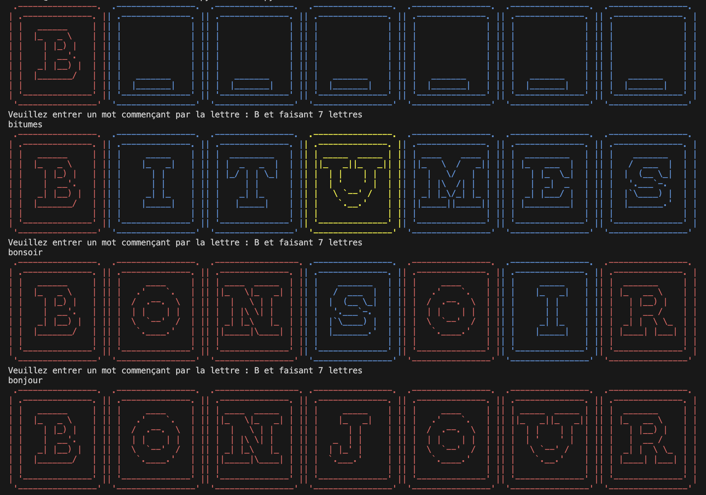

# Osmut

**:star2: Personnal Motus :star2:**

## Rules

Guess the mystery word ! :checkered_flag:

* 6 attempts
* 6 to 9 letters long word
* no proper nouns

Each letters of the word can be :

| state         | description
|---------------|------------------|
|:red_square:   | correctly placed |
|:yellow_square:| misplaced        |
|:blue_square:  | not in the word  |

## How to play

Run tests : ```python3 run_tests.py```  
Run game : ```python3 main.py```

## Example


